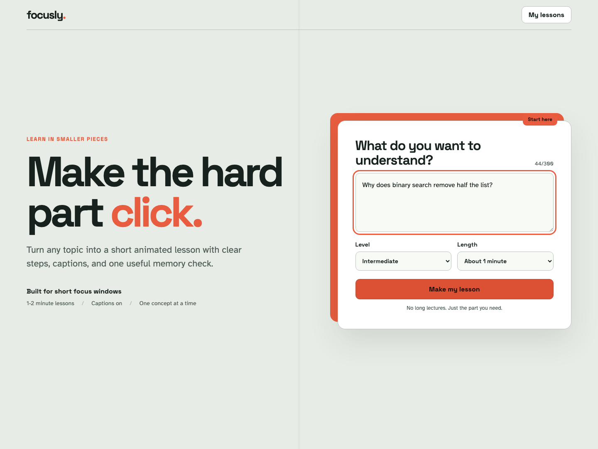
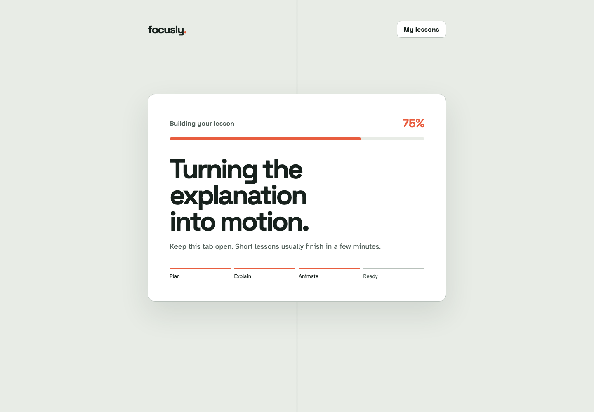
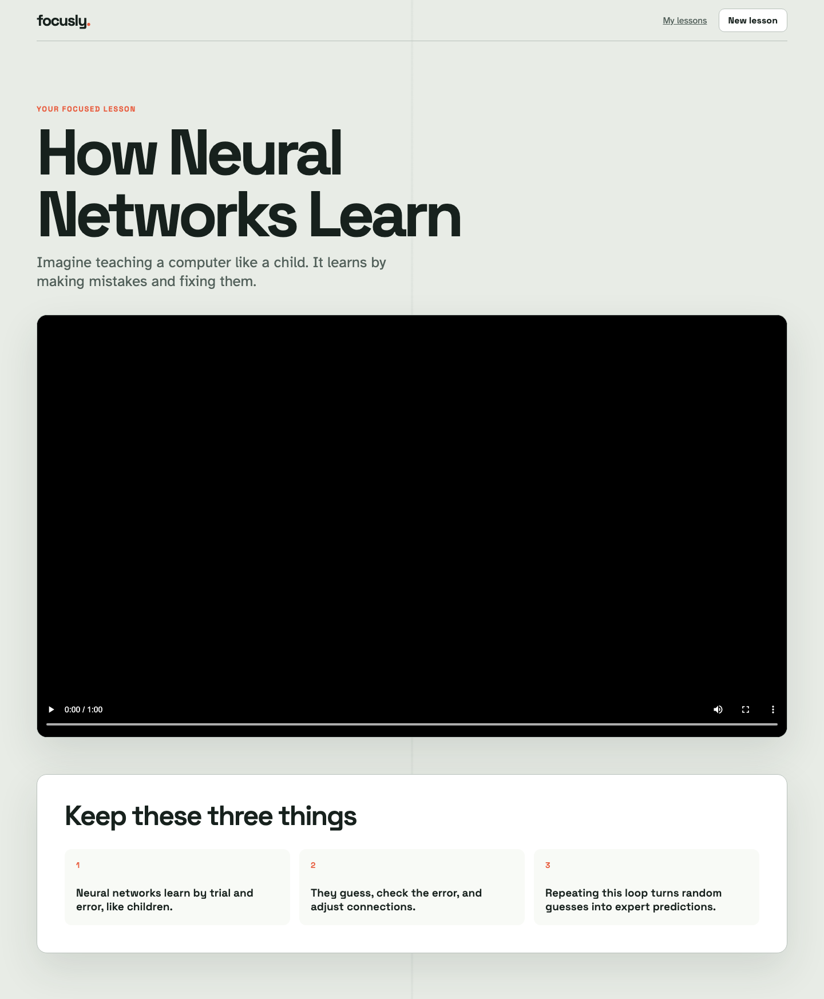
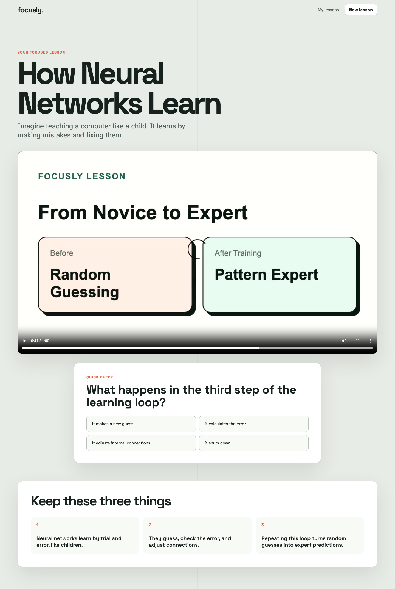
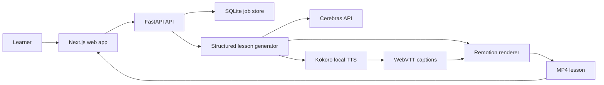

# Focusly

> Turn any topic into a short animated lesson with narration, captions, progress tracking, and quiz checkpoints.

[](https://github.com/pankaj-raikar/focusly/stargazers)
[](https://github.com/pankaj-raikar/focusly/commits/main)
[](https://nextjs.org/)
[](https://fastapi.tiangolo.com/)
[](https://www.python.org/)
[](https://www.typescriptlang.org/)
[](https://www.remotion.dev/)



Focusly is an AI-powered learning app built for short focus windows. Enter a topic, choose the audience level and lesson length, and Focusly builds a focused 1-2 minute lesson with structured visuals, local narration, synchronized captions, and a knowledge check.

[Features](#what-focusly-does) | [Product tour](#product-tour) | [Quick start](#quick-start) | [Architecture](#how-it-works) | [API](#api-surface) | [Contributing](#contributing)

## What Focusly does

- Converts a free-form topic into a structured lesson with 3-5 focused segments
- Adapts explanations for beginner, intermediate, and advanced learners
- Generates title, bullet, comparison, step, and diagram scenes
- Produces local speech with Kokoro and matches narration to scene timing
- Renders animated MP4 lessons with Remotion
- Creates synchronized WebVTT captions
- Inserts quiz checkpoints with answers and explanations
- Tracks generation progress across planning, narration, and rendering
- Saves completed lessons in a reusable library
- Supports safe failure states and one-click retries

## Product tour

| Generate a focused lesson | Follow generation progress |
| --- | --- |
|  |  |

| Watch the animated lesson | Check understanding |
| --- | --- |
|  |  |

## How it works



1. The web app submits a topic, audience level, and 60-120 second target.
2. FastAPI validates the request, creates a job, and starts generation.
3. The configured Cerebras model returns a validated lesson package.
4. Kokoro generates local narration for every segment.
5. Focusly aligns narration timing and writes WebVTT captions.
6. Remotion renders the lesson into an MP4.
7. The lesson page combines video, captions, recap points, and quiz checkpoints.

## Quick start

### Requirements

- Node.js 22 or newer
- pnpm 10
- Python 3.12
- [uv](https://docs.astral.sh/uv/)
- FFmpeg and FFprobe
- A Cerebras API key

### Install

```bash
git clone https://github.com/pankaj-raikar/focusly.git
cd focusly
pnpm install
cd apps/api && uv sync && cd ../..
cp .env.example .env
```

Set your API key in `.env`.

```dotenv
CEREBRAS_API_KEY=your_api_key
```

The default model, API base URL, Kokoro voice, CORS origin, and public API URL are already documented in [`.env.example`](.env.example).

### Run

```bash
pnpm dev
```

Open the web app at [http://localhost:3000](http://localhost:3000). The API runs at [http://localhost:8000](http://localhost:8000).

## Repository layout

```text
focusly/
|-- apps/
|   |-- api/                 FastAPI, generation pipeline, TTS, captions, and storage
|   `-- web/                 Next.js learner experience
|-- packages/
|   `-- video/               Remotion compositions and scene renderer
|-- docs/                    Architecture, implementation, and validation notes
|-- data/                    Local job database and generated media
|-- package.json             Workspace commands
`-- pnpm-workspace.yaml      Monorepo packages
```

## API surface

| Method | Endpoint | Purpose |
| --- | --- | --- |
| `GET` | `/health` | Check API availability |
| `POST` | `/api/jobs` | Start lesson generation |
| `GET` | `/api/jobs` | List generated lessons |
| `GET` | `/api/jobs/{job_id}` | Read status and progress |
| `POST` | `/api/jobs/{job_id}/retry` | Retry a failed lesson |
| `GET` | `/api/jobs/{job_id}/lesson` | Load lesson and playback metadata |
| `GET` | `/media/{job_id}/{filename}` | Stream generated media |

Interactive API documentation is available at [http://localhost:8000/docs](http://localhost:8000/docs) while the API is running.

## Testing

Run the complete API, rendering, web, type, build, and browser test suite.

```bash
pnpm test
```

Run one workspace at a time when iterating.

```bash
pnpm test:api
pnpm test:video
pnpm test:web
```

The suite covers API contracts, schema validation, narration timing, caption generation, rendering data, React behavior, TypeScript checks, production builds, and end-to-end learner flows.

## Documentation

- [MVP runbook](docs/mvp-runbook.md)
- [System architecture](docs/architect/01-high-level-system-design.md)
- [Backend and frontend architecture](docs/architect/05-backend-frontend-architecture.md)
- [Rendering architecture](docs/architect/04-remotion-manim-rendering.md)
- [Testing strategy](docs/planner/08-testing-strategy.md)
- [Learner validation guide](docs/mvp-learner-validation.md)

## Current scope

Focusly is a local-first MVP. It uses SQLite, FastAPI background tasks, local filesystem media, and a single render lock. This keeps setup small and the generation flow easy to inspect. A durable queue, object storage, authentication, and multi-instance deployment belong in a production phase.

## Contributing

1. Fork the repository.
2. Create a focused branch.
3. Add or update the smallest relevant test.
4. Run `pnpm test`.
5. Open a pull request that explains the user-visible change.

Keep changes narrow, reuse existing patterns, and avoid adding infrastructure before the current MVP needs it.

## Project direction

Focusly is exploring a straightforward idea: hard topics become easier when explanations are shorter, visual, narrated, and interrupted by useful recall. Issues and focused pull requests are welcome.
